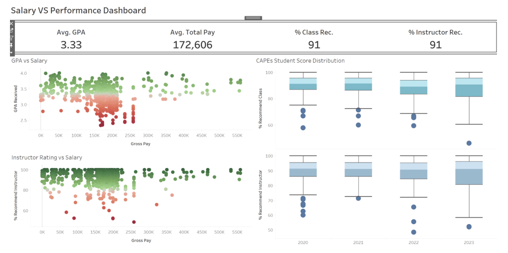

# 📊 CAPES Dashboard & Faculty Salary Equity Analysis

This interactive BI project analyzes the relationship between instructor salary and teaching performance at the **UC San Diego Rady School of Management** using public CAPES evaluation data and faculty salary records. Built with Python and Tableau, the project reveals insights into instructor effectiveness, compensation fairness, and academic outcomes.

---

## 🎯 Project Objectives

- Visualize how teaching performance (based on CAPES evaluations and GPA) relates to instructor salary.
- Uncover salary disparities by **gender**, **title**, and **year**.
- Compare individual performance to **title-level averages**.
- Help Rady School leadership improve hiring, compensation, and curriculum decisions.

---

## 🧠 Dashboards Overview

This project includes **five Tableau dashboards**:

| Dashboard | Description |
|----------|-------------|
| **Student Performance** | Ranks instructors by student recommendation rates and academic outcomes (GPA, study time). |
| **Instructor Salary** | Breaks down total/base salary by title and year, with instructor-specific filtering. |
| **Salary vs Performance** | Compares instructor salaries with GPA and student recommendation scores. |
| **Gender vs Pay** | Highlights salary growth, workload, and variation between male and female faculty. |
| **Individual vs Title Average** | Compares individual performance vs average KPIs within their title group. |

---

## 📷 Dashboard Snapshots

### 💡 Salary vs Performance

- Avg. GPA: **3.33** | Avg. Pay: **$172,606**
- GPA and instructor ratings tend to rise with higher salaries.
- Box plots show stable student recommendation trends from 2020–2023.

---

### 💵 Instructor Salary Dashboard

- **61 instructors analyzed**
- Salary distribution grows over time, especially in 2022.
- Professors and associate professors dominate the top salary brackets.

---

## 📊 Key Findings

### 📚 Student-Level Insights
- Rady students perform consistently: GPA ~3.34 and 90% class/instructor recommendation.
- Study habits increase in summer, but GPA remains steady.
- CAPES metrics can be subjective—student perceptions may not reflect actual instructor quality.

### 💰 Salary Patterns
- Salaries grow steadily year over year.
- Tenured professors make significantly more than lecturers.
- Research/publication involvement appears tied to higher compensation.

### ⚖️ Gender Disparities
- Female faculty earn **$40,000 less on average** under similar workloads.
- Male salaries show higher variation with several high outliers.
- Salary growth peaked in 2022, but female pay regressed more than male pay.

### 🎯 Performance vs Pay Alignment
- High-salary professors generally perform well in GPA and recommendation metrics.
- Some low-performing instructors have consistently low scores—potential overpayment.
- Low-performing courses often correlate with lower GPA, raising curriculum concerns.

---

## 🔍 Data Sources

| Source | Description |
|--------|-------------|
| **CAPES Data (Kaggle)** | Scraped UCSD course evaluations post-CAPES shutdown in 2023. Cleaned and processed for Tableau. |
| **Faculty Salary (UC Wage Database)** | Scraped using Selenium; structured for year/title-level analysis. |
| **Tools Used** | Python (Pandas, Regex), Selenium, Tableau Desktop |

---

## ⚙️ Data Preparation Steps

1. **Instructor Name Cleanup** – Split names using regex for merge consistency.
2. **Quarter to Year Parsing** – Convert CAPES date format using custom logic.
3. **CAPES Score Formatting** – Standardize percentage fields to float values.
4. **GPA Extraction** – Parsed GPA from grade distribution strings via regex.
5. **Salary Scraping** – Automated search using instructor name, year, and location.

---

## 🧩 Dashboard Interactivity

- **Filter by Instructor, Title, or Year** across dashboards.
- **Click on data points** to reveal KPIs, drill-downs, and comparisons.
- Cross-dashboard linking helps trace pay-performance dynamics clearly.

---

## 📁 Project Structure

| File | Description |
|------|-------------|
| `code.ipynb` | Data cleaning and merging notebook. |
| `project_book_2.twbx` | Tableau workbook with all dashboards. |
| `data/*.csv` | Raw and cleaned CAPES/salary datasets. |
| `images/*.png` | Exported dashboard visualizations. |

---

## 👥 Team Members

- **Chen-Fan Lee** – Dashboard Creation  
- **Ethan Lu** – Final Documentation, Dashboard Fixes  
- **Ryosuke Oguchi** – Data Collection & Cleaning  
- **Nicole Ou** – Data Prep & Visualization  

---

## 📬 Contact

**Author**: _Your Name_  
🌐 [your-portfolio.com](https://your-portfolio.com)  
📧 your.email@example.com  
🔗 [LinkedIn](https://linkedin.com/in/yourprofile)

---

## ✅ Recommendations

- **Audit pay equity** across gender, title, and workload annually.
- **Review outlier performance** cases to align salary with teaching outcomes.
- **Update CAPES alternatives** to standardize evaluation inputs across departments.

---

## 💡 Why This Matters

As tuition increases and academic equity becomes more visible, universities must ensure that:
- Students receive value-aligned instruction.
- Instructors are rewarded based on clear, data-backed performance.
- Structural inequities (e.g. gender bias) are proactively addressed.

This project equips administrators with the data tools to meet those goals.

